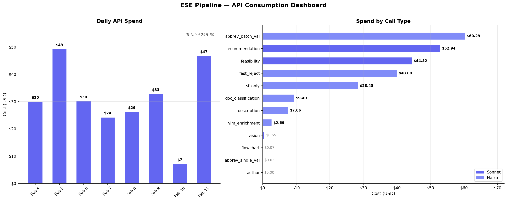

# ESE Pipeline Accuracy Dashboard

> Last updated: 2026-02-12

| Entity | Benchmark | Docs | TP | FP | FN | Precision | Recall | F1 | Delta | Perfect |
|--------|-----------|------|----|----|----|-----------|--------|----|-------|---------|
| Disease | BC5CDR | 20 | 97 | 3 | 7 | 97.0% | 93.3% | 95.1% | +2.6 | 4/20 |
| Drug | BC5CDR | 20 | 55 | 6 | 17 | 90.2% | 76.4% | 82.7% | +2.1 | 4/20 |
| Drug | CADEC | 311 | 272 | 20 | 22 | 93.2% | 92.5% | 92.8% | -0.2 | 282/311 |
| Gene | NLM-Gene | 46 | 198 | 84 | 26 | 70.2% | 88.4% | 78.3% | +0.0 | 6/46 |
| Gene | RareDisGene | 100 | 93 | 90 | 8 | 50.8% | 92.1% | 65.5% | +0.0 | 44/100 |
| Disease | NLP4RARE | 100 | 280 | 29 | 42 | 90.6% | 87.0% | 88.7% | -0.2 | 52/100 |
| Abbreviation | NLP4RARE | 100 | 16 | 3 | 8 | 84.2% | 66.7% | 74.4% | — | 52/100 |
| Author | PubMed Authors | — | — | — | — | — | — | — | — | — |
| Citation | PubMed Authors | — | — | — | — | — | — | — | — | — |
| Disease | NLP4RARE dev | 20 | 79 | 9 | 10 | 89.8% | 88.8% | 89.3% | +0.0 | 10/20 |
| Abbreviation | NLP4RARE dev | 20 | 5 | 0 | 0 | 100.0% | 100.0% | 100.0% | +0.0 | 10/20 |
| Disease | NCBI Disease | 73 | — | — | — | — | — | 54.4% | — | 13/73 |
| Feasibility (epi) | Synthetic | 20 | 39 | 32 | 11 | 54.9% | 78.0% | 64.5% | — | — |
| Feasibility (screen) | Synthetic | 20 | — | — | — | — | — | — | — | 100% |
| Feasibility (design) | Synthetic | 20 | — | — | — | — | — | — | — | 97% |

> **Delta** = F1 change since last evaluation run.
> Rows with — need a fresh evaluation run to fill in.

## API Credit Balance

> Last updated: 2026-02-12

| Date | Balance | Spend Since Last | Notes |
|------|---------|-----------------|-------|
| 2026-02-12 | **$249.40** | — | Initial tracking. Cost reduction deployed (context truncation, batch sizes, sf_only batching, rec caching, metadata merge). |

## API Consumption

> Last updated: 2026-02-12 — Total: **$246.60** across 81,622 calls

| Call Type | Model | Calls | Cost |
|-----------|-------|-------|------|
| abbreviation_batch_validation | Haiku | 16,260 | $60.29 |
| recommendation_extraction | Sonnet | 11,270 | $52.94 |
| feasibility_extraction | Sonnet | 9,336 | $44.52 |
| fast_reject | Haiku | 11,101 | $40.00 |
| sf_only_extraction | Haiku | 18,633 | $28.45 |
| document_classification | Haiku | 1,416 | $9.40 |
| description_extraction | Haiku | 1,416 | $7.66 |
| vlm_visual_enrichment | Haiku | 325 | $2.69 |
| Other (4 types) | Mixed | 63 | $0.65 |

| Model | Calls | Cost | % |
|-------|-------|------|---|
| Sonnet 4 | 35,597 | $161.35 | 65.4% |
| Haiku 4.5 | 46,025 | $85.25 | 34.6% |

## Changelog

| Date | Change | Impact |
|------|--------|--------|
| 2026-02-12 | API cost reduction: context 400->200, batch sizes 2x, sf_only 5->3 chunks + single call, rec caching, metadata merge | No regression. NLP4RARE: Disease 89.3% (+0.0), Abbrev 100% (+0.0). BC5CDR 20-doc: Disease 95.1% (+2.6), Drug 82.7% (+2.1). |
| 2026-02-12 | Full benchmark run: filled TP/FP/FN for CADEC, NLM-Gene, RareDisGene, NLP4RARE | CADEC Drug F1 92.8%, Gene F1s stable, NLP4RARE combined 100-doc Disease 88.7% |
| 2026-02-11 | Disease cross-ref FP filter, expanded drug/disease lexicons | Disease F1 86.7% stable, Drug F1 85.3% (LLM variance range 85.3-86.2%) |
| 2026-02-11 | Drug FP filter: compound ID, bio entities, author "et al" only | Drug P 87.5%->93.8%, F1 81.5%->86.2% |
| 2026-02-11 | Dataset-aware FP filter, acronym collision filters | Disease F1 83.4%->86.7%, Drug F1 79.0%->86.2% |
| 2026-02-10 | Drug lexicon variants, opioid FP filter, eval alt_name | Drug F1 79.1%->81.2% |
